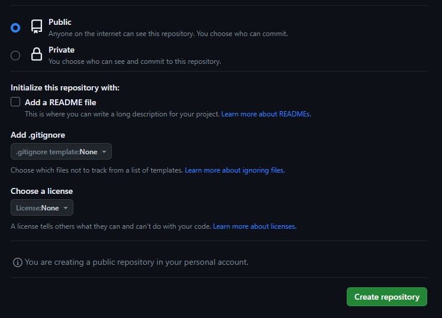
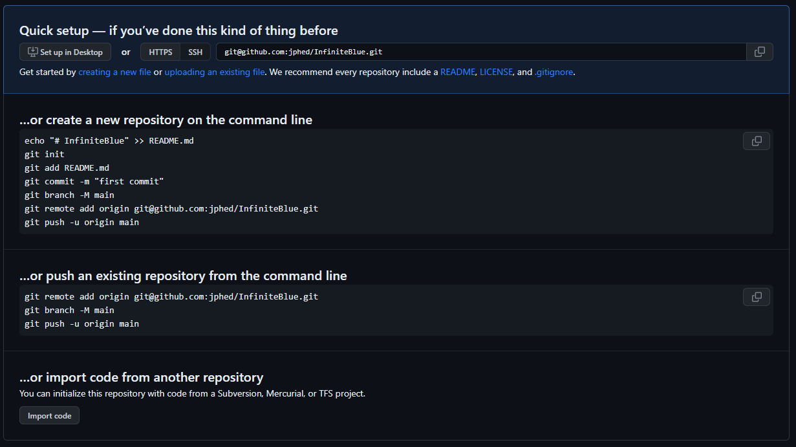

# How to properly set up a GitHub repository **not dying in the process** (maybe)

## Step 1 - Who's this random?
> Introduce yourself to Git and say "Hi" loser, don't be rude 🔔🔔🔔  
> `git config --global user.name "Name Last_Name"` 
> `git config --global user.email random@gmail.com`  
> First step ain't necessary at all but at least Git is gonna know who are you (you're not special).  
> Also just so you don't mess it up crate a new folder on your Desktop, call it whatever you want just make sure when you open the terminal head to the path of the folder **(example: cd Desktop/RepositoryFolder)** or you can simply right click on the folder and open GIT terminal but that's for losers, we the nerdGANG bois.

## Step 2 - Make SSH keys and link them to GitHub
> You're first gonna set up your ssh key so type the following command on your terminal, just replace the email to yours:  
> `ssh-keygen -t ed25519 -C "your_email@example.com`  
> In case this doesn't work you're super unlucky so try this instead! **JUST IF THE PREVIOUS COMMAND DIDNT WORK**  .
> `ssh-keygen -t rsa -b 4096 -C "your_email@example.com"`  
> Either way you're gonna get asked to type a password, please something not forgettable, in my case its "RamRanchReallyRocks31" cause cowboys never die! Oh yeah Shawn!  
> Next up you're going to your GitHub account, go to **settings > SSH and GPG keys** and add the key you were given, it should have already told you the path were the key was stored so just open it up and paste the key to your GitHuh on "add new key" Pretty much what this does it enables connection from your PC to the GitHub repository.

## Step 3 - Create a new repository on GitHub
> Head to Github and create a new repository and make sure to have these settings, we don't want GitHub to create the readme.md file because we're creating it ourselves.  
>    
> Once done, you will go to the repository you just created and something similar to this must show up.   
>   
> Here you can copy most of the commands I'm gonna show you, dont paste exactly my commands because they were made for my repository, just change the important stuff with **your repository data**.

## Step 4 - initialize your repository and establish connection
> Here's when fun starts bois. We go to Git terminal and be sure to be on the path of the folder you created on step 1 and type.   
> `git init` 
> `git remote add origin git@github.com:jphed/LitFuse.git`  
> This will initialize the repository on your folder and establish connection to your GitHub.

## Step 5 - "Add README.md" file
> Don't panick moron we almost got it!!  
> Make a new file on visual studio, call it "README.md". I'm not teaching you MarkDown but just for the sake of simplicity copy this code to the file and save it.  
> `# Version 1.0` 
> `## deez nuts` 
> `> new repository`

## Step 6 - Commit and push

[Hit me up on Discord as "helixnotfound" if you're IQ is lower than 6 ;)](https://www.youtube.com/watch?v=dQw4w9WgXcQ)